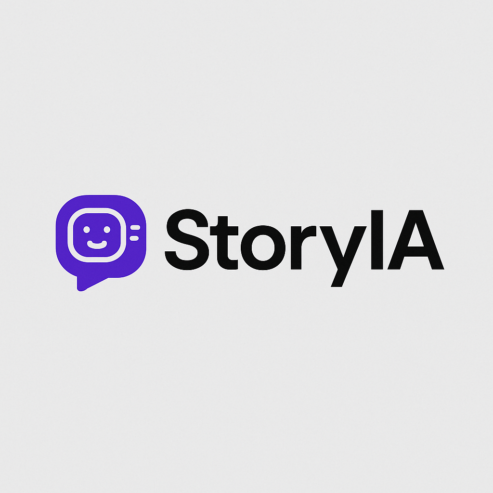

# 🎬 StoryIA — Plataforma de Análisis Narrativo para Videos

**StoryIA** es una plataforma integral de análisis narrativo diseñada para creadores de contenido de **TikTok**, **YouTube** y formatos cortos. Permite evaluar y optimizar guiones, miniaturas y elementos estratégicos con el fin de aumentar el rendimiento, la retención de audiencia y las probabilidades de éxito de tus videos.

Con StoryIA puedes:

### 🎭 **1. Analizar guiones y miniaturas**

* Cargar tu guión y miniatura directamente.
* Obtener un **puntaje de probabilidad de éxito** basado en modelos entrenados con miles de videos virales.
* Descubrir **fortalezas narrativas**, fallos de retención y elementos a mejorar.
* Ver miniaturas reales y vídeos relacionados con la tuya.

### 🤖 **2. Recibir feedback experto con IA**

* Acceder a un **chatbot especializado** en narrativa, storytelling y retención.
* Mejorar tu guión con recomendaciones personalizadas basadas en técnicas que funcionan en contenido viral.

### 🔍 **3. Explorar la base de datos completa**

* Navegar entre todos los videos analizados por la plataforma.
* Ver sus:

  * Guiones completos
  * Miniaturas
  * Hashtags
  * Técnicas narrativas usadas
  * Palabras más repetidas
* Identificar patrones de éxito y replicarlos en tu propio contenido.

### #️⃣ **4. Generar hashtags optimizados**

* Obtener una recomendación automática de hashtags relevantes y de alto rendimiento para tu video.

### 🎧 **5. Crear audio con voz artificial**

* Generar narraciones en voz profesional usando IA para acompañar tus videos.

### 📈 **6. Comparar mediante embeddings**

* Ver qué videos son más similares al tuyo en términos narrativos o visuales.
* Compararte contra contenido viral para guiar tu proceso creativo.
